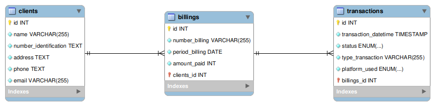

GET http://localhost:3000/reports/clients/total-paid
# Billing & Payments System — API + CSV Loader

This repository contains a small **PostgreSQL + Express** back end with simple HTML files for creating clients and a CSV loader for seeding demo data. It models **clients**, **billings (invoices)**, **transactions**, and **users**.

> NOTE: File names and sample data are in Spanish, but this README is in English as requested.

## 1) System Description

- **Clients**: Basic identification and contact info.
- **Billings (Invoices)**: Each invoice belongs to a client and records the *amount paid* for a billing period.
- **Transactions**: Payment attempts related to a specific billing (invoice). Each transaction has:
  - `status` (enum): `Completada`, `Fallida`, `Pendiente`
  - `plataform` (enum): `Nequi`, `Daviplata`
  - `date_time`, `type`, and a foreign key to the related billing.
- **Users**: Basic user table (not central to the queries below).

### Key Files

- `/back-end/app.js` — Express server and endpoints (PostgreSQL `pg` client).
- `/upload-csv.js` — Node script to load CSV data.
- `/back-end/data/*.csv` — Seed CSVs for clients, billings, and transactions.
- `/data/db.sql` — Database DDL (PostgreSQL types, tables).
- `/docs/MER.png` — Entity-Relationship model image.
- `/front-end/*` — Minimal HTML/JS for demo.

## 2) How to Run the Project

### Prerequisites
- **Node.js** 18+
- **PostgreSQL** 14+

### Database Setup

1. Create the database and types/tables (edit DB name if you prefer):

```sql
-- data/db.sql (excerpted / normalized names)
CREATE DATABASE pd_diego_zuluaga_vanrossum;

CREATE TYPE status_transactions AS ENUM ('Completada', 'Fallida', 'Pendiente');
CREATE TYPE plataform_pay AS ENUM ('Nequi', 'Daviplata');

CREATE TABLE clients (
  id SERIAL PRIMARY KEY,
  name VARCHAR(255) NOT NULL,
  number_identification TEXT UNIQUE NOT NULL,
  address TEXT NOT NULL,
  phone TEXT NOT NULL,
  email VARCHAR(255) UNIQUE NOT NULL
);

CREATE TABLE billings (
  id SERIAL PRIMARY KEY,
  number_billing VARCHAR(255) NOT NULL,
  period_billing VARCHAR(255) NOT NULL,
  amount_paid INT NOT NULL,
  client_id INT NOT NULL REFERENCES clients(id) ON DELETE CASCADE
);

CREATE TABLE transactions (
  id SERIAL PRIMARY KEY,
  date_time TIMESTAMP NOT NULL,
  status status_transactions NOT NULL,
  type TEXT NOT NULL,
  platform plataform_pay NOT NULL,
  billing_id INT NOT NULL REFERENCES billings(id) ON DELETE CASCADE
);

```

> If your existing `data/db.sql` differs, adjust the queries below to match your actual column names. The CSV headers map to equivalent fields:
> - `billings.csv`: `numeroFactura` → `number_billing`, `periodoFacturación` → `period_billing`, `montoPagado` → `amount_paid`, `idCliente` → `client_id`  
> - `clients.csv`: `nombreCliente` → `name`, `numeroIdentificacion` → `number_identification`, `direccion` → `address`, `telefono` → `phone`, `correoElectronico` → `email`  
> - `transactions.csv`: `FechaHoraTransacción` → `date_time`, `EstadoTransacción` → `status`, `TipoTransacción` → `type`, `PlataformaUtilizada` → `platform`, `id_facturación` → `billing_id`

### Back End

```bash
cd back-end
npm install
# Configure DB connection via environment variables or edit app.js:
#   PGUSER, PGHOST, PGDATABASE, PGPASSWORD, PGPORT
node app.js
# Server starts on http://localhost:3000
```

## 3) Technologies Used
- **Node.js**, **Express**
- **PostgreSQL** with `pg` driver
- **HTML/CSS/JS** (simple front-end forms)
- **CSV Loader** with `csv-parser`

## 4) Normalization (Brief Explanation)

- **1NF**: Atomic columns (no repeating groups); e.g., each transaction row stores a single `status`, `platform`, `date_time`.
- **2NF**: Non-key attributes depend on full key. Primary keys are single-column `id` in each table; attributes depend on that key.
- **3NF**: Non-key attributes do not depend on other non-key attributes. For example, `clients` contact info does not depend on `number_billing`; invoices (`billings`) reference the client by `client_id`. `transactions` reference `billings` by `billing_id` to avoid duplication.

This structure prevents anomalies, reduces redundancy, and makes aggregation/querying straightforward.

## 5) Bulk Load from CSV

You can seed data using the provided loader:

```bash
# from repo root
npm install
node upload-csv.js users
node upload-csv.js billings
node upload-csv.js transactions
```

> The loader expects a working Postgres connection in `upload-csv.js`. Update credentials as needed.

## 6) Advanced Queries (for Postman)

Below are **SQL** queries and **HTTP endpoints** you can expose. If your `app.js` already has a router, add these handlers; otherwise, append them directly.

### A) Total amount paid by each client

**Suggested Endpoint (GET)** `/reports/clients/total-paid`

```js
app.get('/reports/clients/total-paid', async (req, res) => {
  try {
    const q = `
      SELECT c.id AS client_id, c.name AS client_name,
             COALESCE(SUM(b.amount_paid), 0) AS total_paid
      FROM clients c
      LEFT JOIN billings b ON b.client_id = c.id
      GROUP BY c.id, c.name
      ORDER BY total_paid DESC, client_name ASC;
    `;
    const { rows } = await pool.query(q);
    res.json(rows);
  } catch (err) {
    console.error(err);
    res.status(500).json({ error: 'Internal Server Error' });
  }
});
```

**Postman Example**
- **Method:** GET  
- **URL:** `http://localhost:3000/reports/clients/total-paid`

---

### B) Pending invoices with client + associated (latest) transaction info

**Definition**: An invoice is **pending** if its **latest** transaction status is not `Completada` (or if it has no transaction yet).

**Suggested Endpoint (GET)** `/reports/billings/pending`

```js
app.get('/reports/billings/pending', async (req, res) => {
  try {
    const q = `
      WITH last_tx AS (
        SELECT DISTINCT ON (t.billing_id)
               t.billing_id, t.id AS transaction_id, t.status, t.platform, t.date_time
        FROM transactions t
        ORDER BY t.billing_id, t.date_time DESC
      )
      SELECT b.id AS billing_id, b.number_billing, b.period_billing, b.amount_paid,
             c.id AS client_id, c.name AS client_name,
             lt.transaction_id, lt.status AS transaction_status,
             lt.platform AS transaction_platform, lt.date_time AS transaction_date
      FROM billings b
      JOIN clients c ON c.id = b.client_id
      LEFT JOIN last_tx lt ON lt.billing_id = b.id
      WHERE COALESCE(lt.status, 'Pendiente') <> 'Completada'
      ORDER BY b.id;
    `;
    const { rows } = await pool.query(q);
    res.json(rows);
  } catch (err) {
    console.error(err);
    res.status(500).json({ error: 'Internal Server Error' });
  }
});
```

**Postman Example**
- **Method:** GET  
- **URL:** `http://localhost:3000/reports/billings/pending`

---

### C) List transactions by platform (Nequi or Daviplata)

**Suggested Endpoint (GET)** `/reports/transactions/by-platform/:platform`

```js
app.get('/reports/transactions/by-platform/:platform', async (req, res) => {
  try {
    const { platform } = req.params; // 'Nequi' | 'Daviplata'
    const q = `
      SELECT t.id, t.date_time, t.status, t.type, t.platform, t.billing_id,
             b.number_billing, c.name AS client_name
      FROM transactions t
      JOIN billings b ON b.id = t.billing_id
      JOIN clients c ON c.id = b.client_id
      WHERE t.platform = $1
      ORDER BY t.date_time DESC;
    `;
    const { rows } = await pool.query(q, [platform]);
    res.json(rows);
  } catch (err) {
    console.error(err);
    res.status(500).json({ error: 'Internal Server Error' });
  }
});
```

**Postman Examples**
- **GET** `http://localhost:3000/reports/transactions/by-platform/Nequi`
- **GET** `http://localhost:3000/reports/transactions/by-platform/Daviplata`
- **GET** `http://localhost:3000/users`
- **GET** `http://localhost:3000/users/:id`
- **POST** `http://localhost:3000/users'`
- **PUT** `http://localhost:3000/users/:id`
- **DELETE** `http://localhost:3000/users/:id`

## 7) Relational Model Snapshot

The ER/MR image is in `docs/MER.png`:



## 8) Developer

- **Name:** Diego Zuluaga (Clan VanRossum)  
- **Email:** *diego.zuluagaye@amigo.edu.co*

---

### Notes
- If your production data model deviates from the normalized names above, adapt the column names in the queries accordingly.
